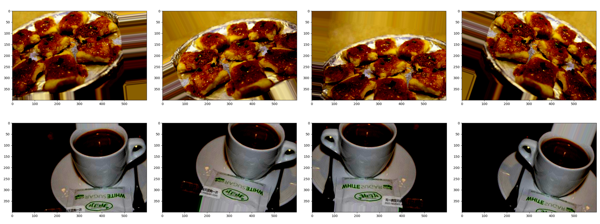
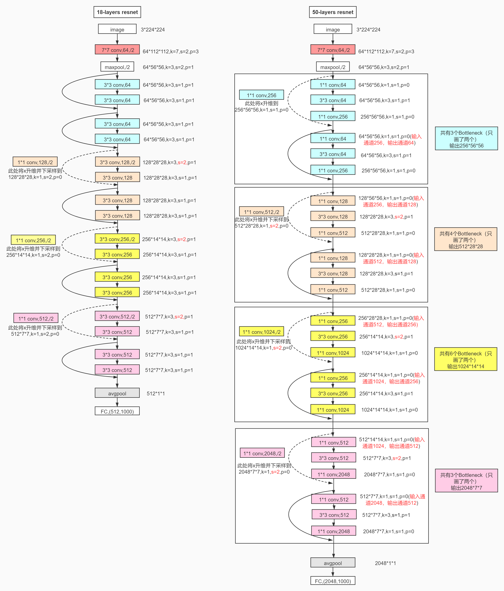

# CNN-based Fine-Grained Categorization for Food Images

LAST: 2020-11-27

对菜品信息的拍照识别，可以提供给用户膳食健康管理和做法百科等功能。尽管深度学习技术在ImageNet场景分类、人脸识别等任务上达到了超越人类的识别性能，但在菜品等细粒度识别任务上依然很难达到商用水平，尤其对于中餐场景，业内尚未有大规模的公开评测集。

针对美团场景的自建菜品图像数据集(MTFood-1000，1000类Food，主要为中餐)，研发图像分类模型或策略。

### 前言

基于卷积神经网络(Convolutional Neural Networks, CNN)的模型框架是解决图像多分类问题的常用手段。细粒度(Fine-Grained)的分类任务要求对同一类图像进行更细致的划分，如区分不同品种的鸟，区分不同品种的鸢尾花......本文利用CNN搭建的模型对上述MTFood-1000数据集中餐进行细粒度多分类，在验证集上的最终的预测效果可以达到`???`。

### 环境配置

* Python --3.6
* CUDA --9.0
* CuDNN --7.3
* Tensorflow --1.12.0
* keras --2.2.4
* h5py --2.10.0

### 数据集&预处理

美团场景的自建菜品数据集(MTFood-1000)共包含三部分数据，放在文件夹`./dataset/`中：

| 文件夹 | 样本数量 | 命名格式 | 是否有标签 | 格式 |
| :-----: | :-----: | :----: | :----: | :----: |
| train | 75,296 | LabelID_ImageID.jpg | 有 | JPEG |
| val | 10,000 | LabelID_ImageID.jpg | 有 | JPEG |
| test | 20,000 | test_ImageID.jpg | 无 | JPEG |

在`./dataset`文件夹下还有`train_list`和`val_list`两个文件，包含了`./dataset/train/`和`./dataset/val/`中所有图片的文件名称。

***NOTE:** MTFood-1000数据集暂未公开，仅用于课程作业。*

**STEP1：统一图片大小** 

数据集图像属性为长宽比不统一的`.jpg`文件，并且大多数图像为宽幅图像，长宽比比例大致为3:2，将所有数据集中的图片重整为`600*400`的大小，方便用于模型的输入。

**STEP2：归一化**

为了使模型的更容易收敛到最优解，对**STEP1**中处理得到的相同大小的图片像素值进行简单归一化处理，是像素值分布在$[-1,1]$之间。

$$ pixel=2\times(\frac{pixel}{255}-0.5)=\frac{pixel}{127.5}-1 $$

**STEP3：提取标签信息**

训练集和验证集中的图像没有单独的标签信息文件，需要从形如`LabelID_ImageID.jpg`的文件名中提取标签信息`LabelID`。

**STEP4：数据生成器（可选）**

对于包含1000类样本的数据集，75295张图片似乎有点少，因此采用`keras.preprocessing.image`中的类`ImageDataGenerator`对原始数据集进行扩充，可以选择的图像处理参数包括`rotation_range`（旋转范围）、`width_shift_range`（水平偏移幅度）、`height_shift_range`（垂直偏移幅度）、`horizontal_flip`（水平翻转图像），随机对原始图像进行上述处理。

### 模型结构

残差网(ResNet)是当今图像分类中最常见的模型，由He Kaiming, Ren Shaoqing, Sun Jian于2016年提出。对于传统的CNN网络，通常认为网络模型的层数越多，模型的学习、表达能力越强。但是在实际应用中发现CNN网络模型层数增加，模型的收敛速度会变慢，准确率反而可能还会下降。

ResNet提出残差学习的概念。传统的CNN网络通过输入$X$得到网络训练的输出$H(X)$，即$X→H(X)$，但在ResNet中的映射关系为$X→[H(X)-X]+X$，其中$H(X)-X$即为网络需要学习输入与输出之间的残差。

常见的ResNet模型结构有：ResNet50、ResNet101、ResNet152、InceptionResNet等。ResNet50的网络模型如下所示。

`keras`可以设置利用Google`ImageNet`上预训练到的权重初始化模型，将ResNet中的参数冻结。并且将ResNet作为基本网络架构，在其之后再添加几层全连接层，得到更多可训练的参数。

### 预测结果

当模型选择为`InceptionResNet`时，在验证集上Top1准确率可以达到59.13%，在测试集上Top3准确率可以达到78.288%。

### 后续工作

* 尝试ResNet之外的其他网络模型
* `ImageDadaGenerator`数据生成器是否真的对模型准确率提升有帮助
* 调参，使验证集Top1准确率提升
* 训练一个epoch时间太长（大约需要8~9小时），简化网络或者将图片更改到更小的尺寸（可能会损失信息，导致准确率下降）。
